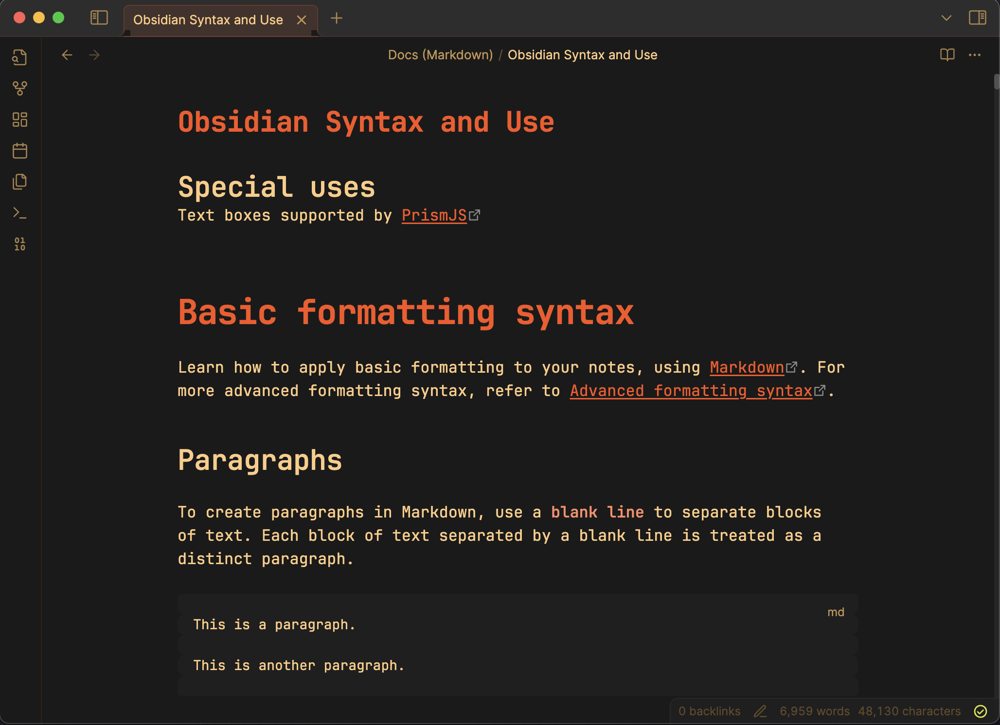

# The80sMan - Professional Obsidian Theme Collection

A sophisticated theme collection for Obsidian featuring two distinct variants designed for professional use and extended reading sessions.

## Theme Variants

### The80sMan - Professional Refined Palette

A sophisticated dark theme featuring a refined color palette with warm orange accents balanced by cool blues and sage greens. This variant prioritizes professional aesthetics with subtle warmth.

**Color Highlights:**
- Deep backgrounds (#1a1a1a to #363636) provide modern depth without harsh contrast
- Warm orange accents (#e67e22, #f39c12) create approachable focal points for headers and interactive elements
- Cool blue links (#5dade2) ensure clear navigation while maintaining professional aesthetics
- Sage green highlights (#27ae60) provide positive feedback and success states
- Graduated text hierarchy uses subtle color variations to guide reading flow

### ICOrangePeople - Warm Orange Palette

A vibrant theme variant featuring a comprehensive warm orange palette with high-contrast elements. This variant emphasizes warmth and energy with bright accent colors.

**Color Highlights:**
- Warm orange primary accent (#fb521c) with complementary shades
- Cream text (#ffcb83) for comfortable reading on dark backgrounds
- Bright yellow highlights (#f6ff3f) for code and success states
- Consistent orange-based color hierarchy throughout all interface elements
- High contrast design for enhanced visibility and focus

## Installation

### Method 1: Manual Installation
1. Download either `The80sMan_1.1.css` or `ICOrangePeople_1.1.css` (or both)
2. Place the desired file(s) in your Obsidian vault's `.obsidian/themes/` folder
3. Open Obsidian Settings > Appearance
4. Select your preferred theme from the dropdown:
   - "The80sMan" for the professional refined palette
   - "ICOrangePeople" for the warm orange palette
5. Ensure dark mode is enabled in Appearance settings

### Method 2: Community Themes
1. Open Obsidian Settings > Appearance > Themes
2. Click "Browse" to open the community themes browser
3. Search for "The80sMan"
4. Click "Install and use"

## Features

Both theme variants include:

- **Refined Typography System**: Color-coded header hierarchy with professional spacing
- **Enhanced Form Styling**: Subtle focus states and smooth transitions
- **Advanced Search Highlighting**: Professional search result presentation with clear visual feedback
- **Accessible Design**: Proper contrast ratios and focus indicators throughout
- **Responsive Layout**: Optimized for various screen sizes and mobile devices
- **Comprehensive Coverage**: Styled components include navigation, tabs, tables, callouts, and more
- **Performance Optimized**: Smooth animations with reduced motion support

## Technical Details

- **Version**: 1.1.0
- **Compatibility**: Obsidian 0.16.0+
- **Mode Support**: Optimized for dark mode (light mode variants included)
- **Plugin Compatibility**: Works with most community plugins
- **Accessibility**: WCAG compliant contrast ratios and keyboard navigation support

## Design Philosophy

The theme collection balances professional sophistication with visual warmth, creating interfaces that feel both trustworthy and approachable. Each variant serves different aesthetic preferences while maintaining consistent usability principles.

**The80sMan** focuses on subtle elegance with a balanced color palette suitable for professional environments and extended reading sessions.

**ICOrangePeople** emphasizes energy and warmth with a bold orange-centric design that creates a more vibrant and engaging workspace.

## Customization

Both themes use CSS custom properties (variables) for easy customization. Key color variables can be modified to create personal variations while maintaining the overall design system integrity.

## Contributing

Issues and suggestions are welcome. Please report any compatibility problems or enhancement requests through the GitHub repository.

## License

This theme collection is released under the MIT License. See LICENSE file for details.

## Author

Created by Dustin Hogate  
GitHub: [@impish0](https://github.com/impish0)
