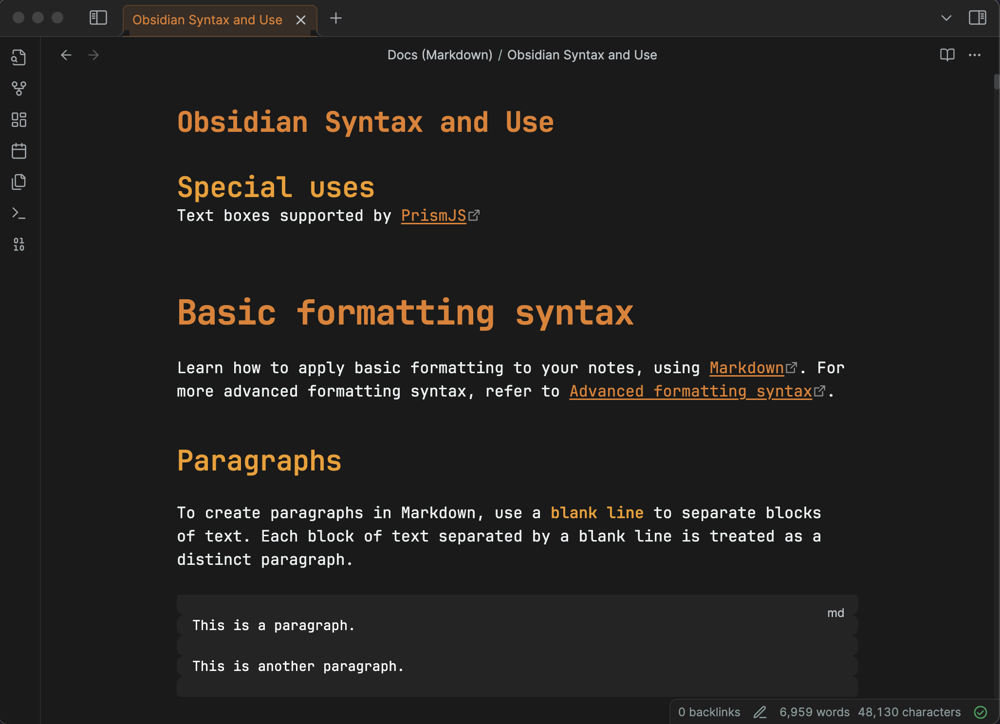

# The80sMan - Professional Obsidian Theme

A sophisticated dark theme for Obsidian featuring a refined color palette designed for professional use and extended reading sessions.

## Color Scheme

This theme uses a carefully balanced palette that prioritizes readability and reduces eye strain while maintaining visual hierarchy:

- **Deep backgrounds** (#1a1a1a to #363636) provide modern depth without harsh contrast
- **Warm orange accents** (#e67e22, #f39c12) create approachable focal points for headers and interactive elements
- **Cool blue links** (#5dade2) ensure clear navigation while maintaining professional aesthetics
- **Sage green highlights** (#27ae60) provide positive feedback and success states
- **Graduated text hierarchy** uses subtle color variations to guide reading flow

The design philosophy balances professional sophistication with subtle warmth, creating an interface that feels both trustworthy and approachable.

## Installation

1. Download `The80sMan_1.0.css`
2. Place the file in your Obsidian vault's `.obsidian/themes/` folder
3. Open Obsidian Settings > Appearance
4. Select "The80sMan" from the theme dropdown
5. Ensure dark mode is enabled in Appearance settings

## Features

- Refined header hierarchy with color-coded levels
- Professional form styling with subtle focus states
- Enhanced search highlighting and navigation
- Accessible contrast ratios throughout
- Smooth transitions and hover effects
- Responsive design for various screen sizes

## Compatibility

Designed for Obsidian's dark mode. Works best with the default Obsidian interface and most community plugins.
