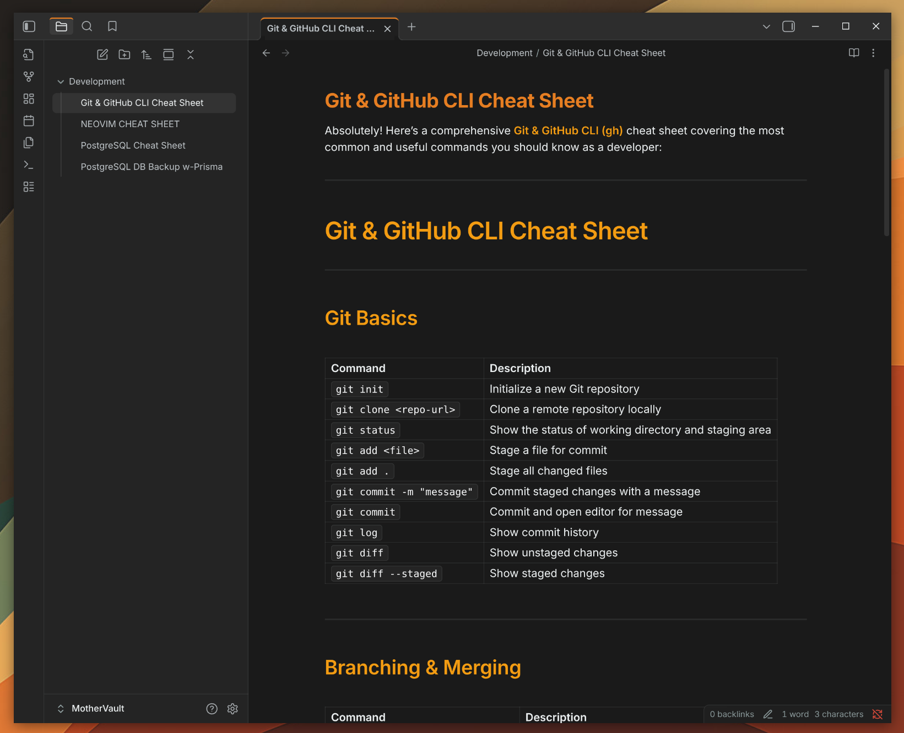
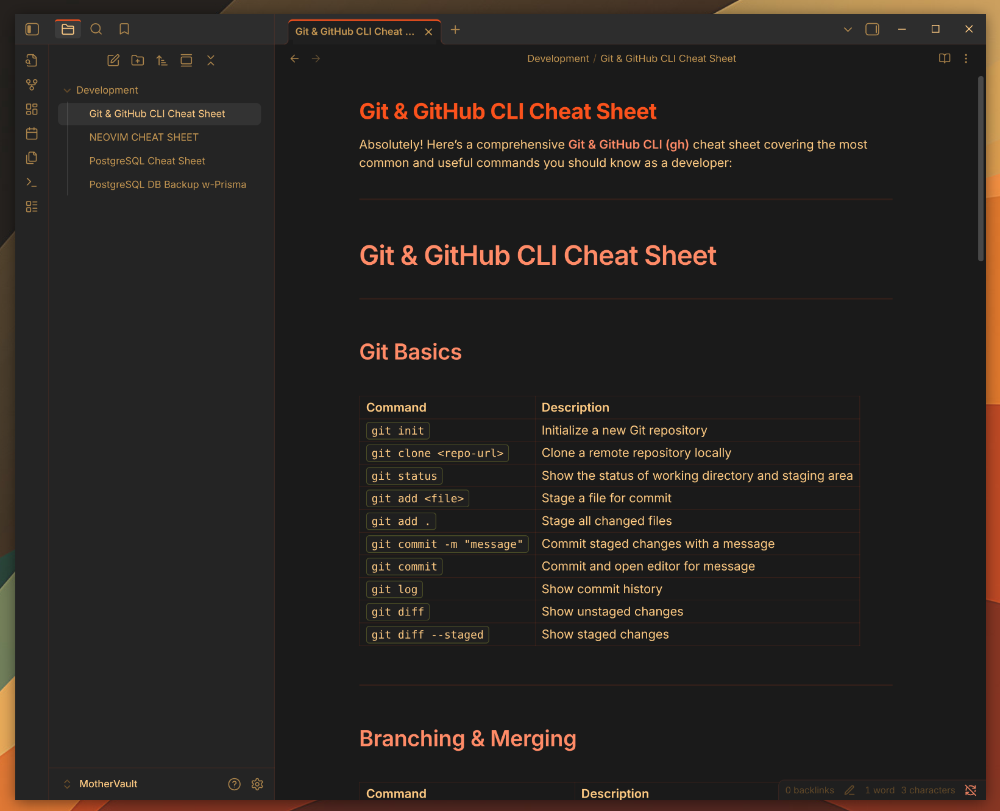
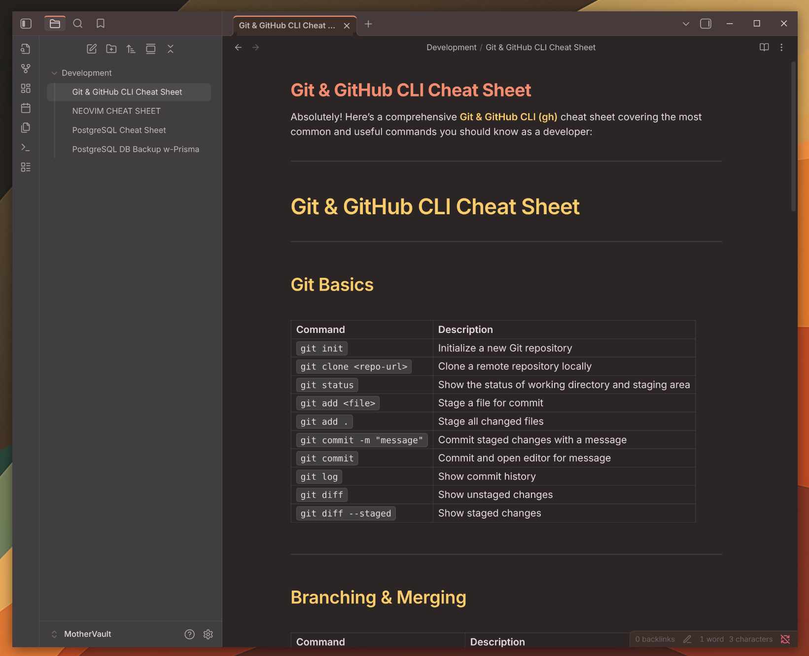

# The80sMan - Obsidian Theme

A sophisticated, customizable, and feature-rich dark theme for Obsidian, designed for professional use and extended reading sessions. This repository includes three variants:

- **The80sMan (theme.css):** The primary, published theme featuring a refined, professional color palette.
- **ICOrangePeople (ICOrangePeople.css):** An unpublished alternative with a vibrant, warm orange palette that maintains feature parity.
- **Ristretto (theme-ristretto.css):** An unpublished alternative with a vibrant, warm orange palette that maintains feature parity.

## The80sMan - Professional Refined Palette

This is the main theme, designed for a clean, professional look. It uses a balanced color palette with warm orange accents, cool blues, and sage greens to create a comfortable and productive workspace.

## ICOrangePeople - Warm Orange Palette

This is an alternative theme for those who prefer a more energetic and vibrant workspace. It features a comprehensive warm orange palette with high-contrast elements.

## Ristretto - Warm Brown Palette

This is an alternative theme for those who prefer a more muted and soft earth tone workspace. It features a comprehensive warm brown palette.

## Installation

1.  Download the `theme-<variant>.css` file from the latest release.
2.  Place the file in your Obsidian vault's `.obsidian/themes/` folder.
3.  Open Obsidian Settings > Appearance.
4.  Select "The80sMan" from the theme dropdown menu.
5.  Ensure dark mode is enabled in Appearance settings.

## Features

- **Three Variants:** Choose between the professional `The80sMan`, the vibrant `ICOrangePeople`, or the `Ristretto` variant.
- **Refined Typography:** A clean and readable typography system.
- **Enhanced Styling:** Custom styling for tabs, navigation, search, and more.
- **Accessible:** Designed with accessibility in mind.
- **Responsive:** Optimized for both desktop and mobile devices.

## Publishing to the Obsidian Theme Store

`The80sMan` is the primary theme and is intended for publication in the official Obsidian theme store. `ICOrangePeople` is an unpublished alternative and is not intended for individual publication.

## License

This theme is released under the MIT License. See the LICENSE file for details.

## Author

Created by Dustin Hogate
GitHub: [@impish0](https://github.com/impish0)
